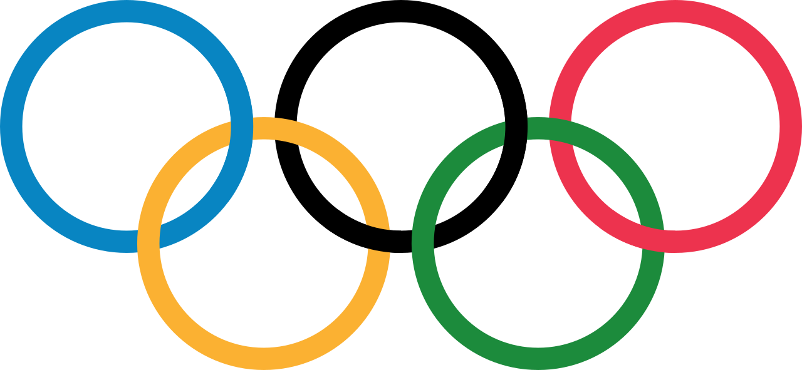
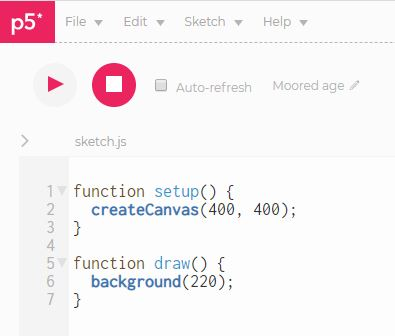
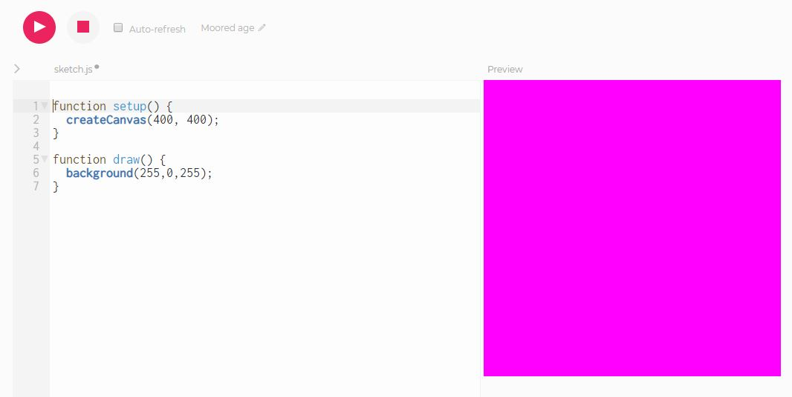
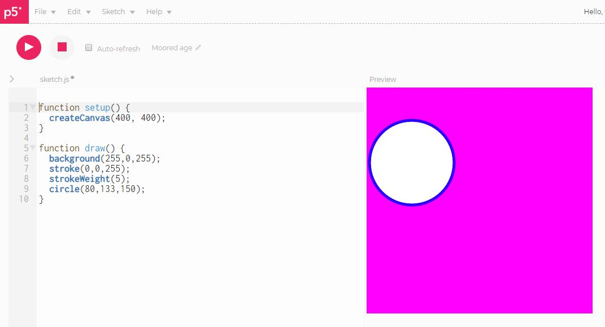
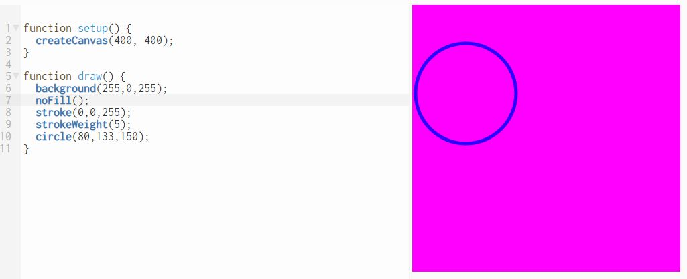
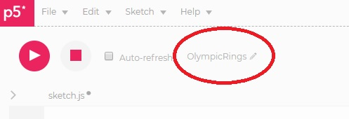
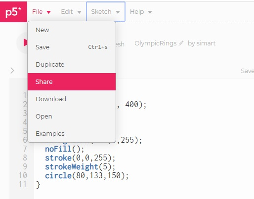
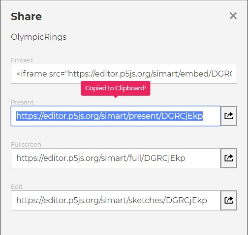

      
Olympic Rings
=======================
In this assignment you will write a JavaScript program that produces a design similar to the Olympic Rings with 5 differently colored circles. We will write the program using the [P5 online editor](https://editor.p5js.org/). You will want to start by visitng the website and creating an account. Then you will see a screen that looks like this:

   

You will notice the program is divided in to two parts each labeled as a `function`: `setup()` and `draw()`. In this assignment we'll leave the `setup()` as is and work with the second `draw` function. Let's start by changing the background color to magenta. Change line 5 to `background(255,0,255);` and press the play button. You should now see a magenta background.

    

Experiment with the background until you are happy with it. The three numbers (called *arguments*) specify the amount of red, green and blue in the range 0 - 255. Once you are happy with the background color you can begin the first ring. Add code after line 6 like this:   
    

`stroke` changes the color of the ring and `strokeWeight` changes its thickness. `circle(80,133,150)` means "draw a circle with a center (80,133) relative to the top left corner with a diameter of 150. By default the ring is filled with white. We can remove that fill with `noFill()` on line 7. We only need to do this once. Once the fill or stroke is set if affects all the code that is written below it:

   

Continue adding code to create more rings. You need to use the functions `circle` and `stroke`  more than once. Change the name of your program by clicking on the pencil. Give your program a meaningful name like `OlympicRings` and periodically save your work by choosing *File | Save*:

When you are finished, copy the URL of your program by choosing *File | Share* and copying the second link labeled *Present*. Submit the link to Google classroom by choosing *Add Link*.

   
    

Resources for learning more
------------------------------------------
1. [Making Drawings with Code](https://www.khanacademy.org/computing/computer-programming/programming/drawing-basics/pt/making-drawings-with-code)
2. [Coloring with Code](https://www.khanacademy.org/computing/computer-programming/programming/coloring/pt/coloring-with-code)

Optional Challenge
------------------
Your Olympic rings don't have to look like any of the samples below. Feel free to read about other [P5 functions](https://p5js.org/reference/) and add other elements to your Olympic rings design. If you want a challenge, you might try to use the [`arc()`](https://p5js.org/reference/#/p5/arc) function instead of `circle()` to make *interlocking* rings like Henry and Emma's programs below.

Samples of Student Work   
-----------------------   
[Mandy](OlympicRingsMandy.PNG)   
[Henry](OlympicRingsHenry.PNG)   
[Emma](OlympicRingsEmma.PNG)   
